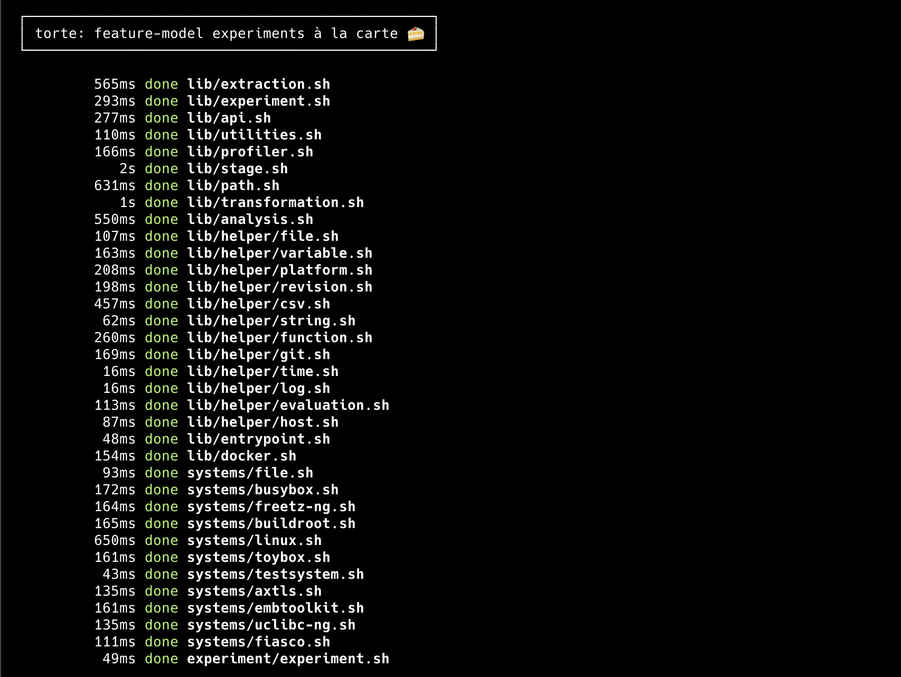
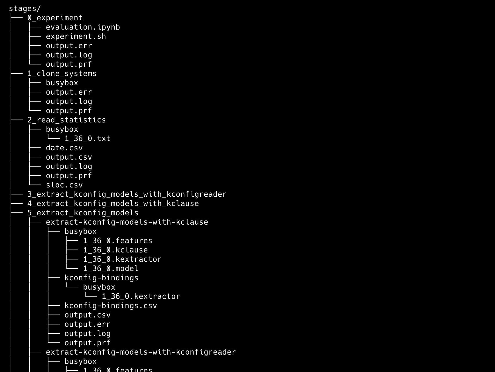
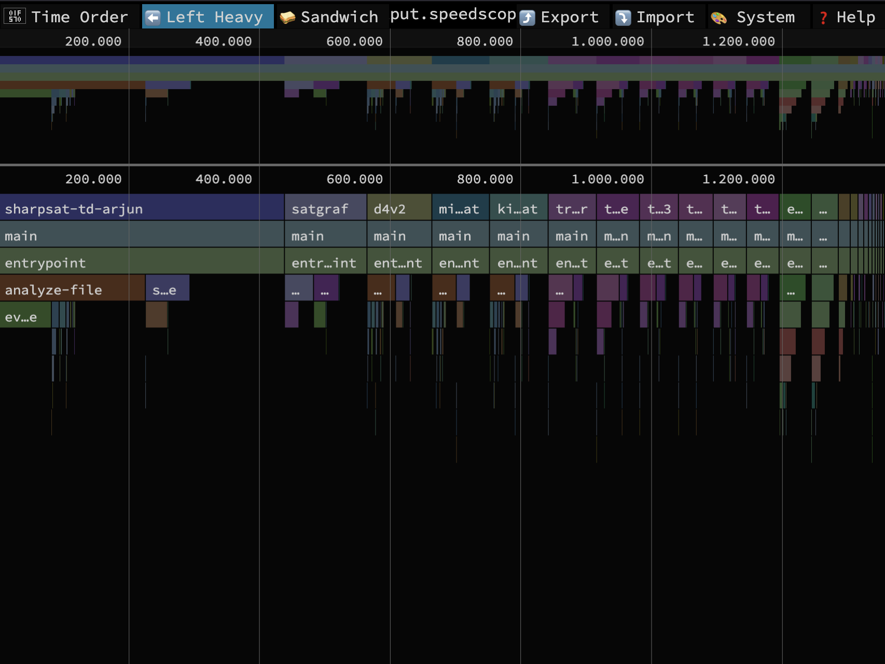
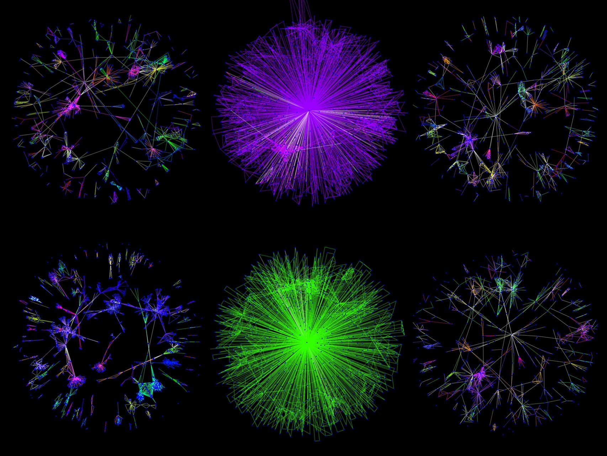

## torte: reproducible feature-model experiments à la carte 🍰

**torte is a declarative experimentation platform for reproducible feature-model analysis research.**

[](meta/cli.png)
[](meta/tree.png)
[](meta/profile.png)
[](meta/satgraf.jpg)

[](https://github.com/ekuiter/torte/actions/workflows/run-tests.yml)
[](https://github.com/ekuiter/torte/releases)
[](https://github.com/ekuiter/torte/blob/main/LICENSE.txt)


Why **torte**?
Take your pick:

- "**T**seitin **or** not **T**seitin?" **E**valuator
- CNF **T**ransf**or**ma**t**ion Workb**e**nch
- KConfig Extrac**tor** that **T**ackles **E**volution
- **To**wards **R**eproducible Feature-Model **T**ransformation and **E**xtraction
- **T**hat's an **O**bviously **R**everse-Engineered **T**ool Nam**e**!
- KConfig = 🍰 config ∧ 🍰 = torte ∎

torte can be used to

- **extract feature models** from KConfig-based configurable software systems (e.g., the [Linux kernel](https://github.com/torvalds/linux)),
- **transform feature models** between various formats (e.g., [FeatureIDE](https://featureide.github.io), [UVL](https://github.com/Universal-Variability-Language), and [DIMACS](https://www.domagoj-babic.com/uploads/ResearchProjects/Spear/dimacs-cnf.pdf)), and
- **solve feature models** with automated reasoners to evaluate the extraction and transformation impact,

all in a fully declarative and reproducible fashion backed by reusable containers.
This way, you can


- **draft experiments** for selected feature models first, then generalize them to a larger corpus later,
- **execute experiments** on a remote machine without having to bother with technical setup,
- **distribute fully-automated reproduction packages** when an experiment is ready for publication, and
- **adapt and update existing experiments** without needing to resort to clone-and-own practices.

## Getting Started: The Quick Way

torte provides three major setup options:

1. This one-liner will get you started with the [default experiment](experiments/default.sh) ([Docker](https://docs.docker.com/get-docker/) or [Podman](https://podman.io/get-started) required).
    ```
    curl -sL https://elias-kuiter.de/torte/ | sh
    ```
    Choose this option if you do not intend to customize torte.
2. You can also clone this repository and run torte directly.
    ```
    git clone --recursive https://github.com/ekuiter/torte.git
    cd torte
    ./torte.sh
    ```
    Choose this option if piping into a shell is no option for you, or if you want to contribute to torte.
3. A third option is to manually download and set up a [release](https://github.com/ekuiter/torte/releases) of torte.
    This increases the total download size, but it also allows you to skip building any Docker images.
    Choose this option if reproducibility matters a lot, or images fail to build with the other options above.

By default, any of these options will store results in the `stages` directory.
Read on if you want to know more details (e.g., how to execute other experiments).

## Getting Started: In Detail

To run torte, you need:

- an `x86_64` or `arm64` system [^28] with Linux, macOS, or Windows with [WSL](https://learn.microsoft.com/windows/wsl/install)
- [Git](https://git-scm.com/), [curl](https://curl.se/), GNU tools ([bash](https://www.gnu.org/software/bash/), [coreutils](https://www.gnu.org/software/coreutils/), [make](https://www.gnu.org/software/make/), [grep](https://www.gnu.org/software/grep/), and [sed](https://www.gnu.org/software/sed/))
- [Docker](https://docs.docker.com/get-docker/) (preferably in [rootless mode](https://docs.docker.com/engine/security/rootless/) on Linux) or [Podman](https://podman.io/get-started)

[^28]: On `arm64` systems (e.g., Windows tablets and Apple Silicon Macs), torte cross-compiles some Docker images to ensure that precompiled binaries (e.g., JavaSMT, Z3, and all solvers) function correctly.
This may negatively impact performance on some systems (e.g., ARM-based Windows tablets), although recent Macs should not be affected due to [Rosetta](https://en.wikipedia.org/wiki/Rosetta_(software)).
(If you encounter errors like [this one](https://github.com/docker/for-mac/issues/7006), try to disable "Use Rosetta for x86_64/amd64 emulation on Apple Silicon" in the Docker settings. This setting can be re-enabled after the Docker images have been built.)
Executing torte from within a virtual machine has only been confirmed to work with Linux guest systems on `x86_64` host systems.
Despite our efforts, some functionality involving precompiled binaries is still known to cause problems on `arm64` systems.
If such functionality is required, the easiest solution is to switch to an `x86_64` system (e.g., with SSH).

Experiment files in torte are self-executing - so, you can just create or download an experiment file (e.g., from the `experiments` directory) and run it.

The following instructions will get you started on a fresh system.
By default, each of these instruction sets will install torte into the `torte` directory.
All experiment data will then be stored in the `stages` directory in your working directory.

### Ubuntu 22.04

```
# install and set up dependencies
sudo apt-get update
sudo apt-get install -y curl git make uidmap dbus-user-session

# install Docker (see https://docs.docker.com/desktop/install/linux-install/)
curl -fsSL https://get.docker.com | sh
dockerd-rootless-setuptool.sh install

# download and run the default experiment
curl -sL https://elias-kuiter.de/torte/ | sh
```

### macOS 14

```
# install and set up dependencies (this will replace macOS' built-in bash with a newer version)
/bin/bash -c "$(curl -fsSL https://raw.githubusercontent.com/Homebrew/install/HEAD/install.sh)"
(echo; echo 'eval "$(/opt/homebrew/bin/brew shellenv)"') >> $HOME/.zprofile
eval "$(/opt/homebrew/bin/brew shellenv)"
brew install bash coreutils gnu-sed grep

# install Docker (see https://docs.docker.com/desktop/install/mac-install/)
curl -o Docker.dmg https://desktop.docker.com/mac/main/arm64/149282/Docker.dmg
sudo hdiutil attach Docker.dmg
sudo /Volumes/Docker/Docker.app/Contents/MacOS/install --accept-license
sudo hdiutil detach /Volumes/Docker
rm Docker.dmg
open /Applications/Docker.app

# download and run the default experiment
curl -sL https://elias-kuiter.de/torte/ | sh
```

### Windows 11

```
# install WSL (see https://learn.microsoft.com/windows/wsl/install)
powershell
wsl --install

# install Docker (see https://docs.docker.com/desktop/install/windows-install/)
Invoke-WebRequest https://desktop.docker.com/win/main/amd64/149282/Docker%20Desktop%20Installer.exe -OutFile Docker.exe
Start-Process Docker.exe -Wait -ArgumentList 'install', '--accept-license'
Remove-Item Docker.exe

# restart your computer, start Docker, then install and set up dependencies
wsl
sudo apt-get update
sudo apt-get install -y curl git make

# download and run the default experiment
curl -sL https://elias-kuiter.de/torte/ | sh
```

**Executing Experiments**

- Above, we run the [default experiment](experiments/default.sh), which extracts, transforms, and solves the feature model of BusyBox 1.36.0 as a demonstration.
To execute another experiment with the one-liner, run `curl -sL https://elias-kuiter.de/torte/ | sh -s - <experiment>` (information about predefined experiments is available [here](#predefined-experiments)).
You can also write your own experiments by adapting an existing experiment file.
- As an alternative to the self-extracting one-line installer shown above, you can clone this repository and run experiments with `./torte.sh <experiment>` (e.g., `./torte.sh busybox-history`).
- Yet another alternative is to download a [release](https://github.com/ekuiter/torte/releases), which is useful to get a specific version of torte.
  To ensure reproducibility, each release includes all Docker images as `.tar.gz` files.
  These can simply be placed in the root directory of this repository and are then loaded automatically by torte, which sidesteps the image build process.
- A running experiment can be stopped with `Ctrl+C`.
  If this does not respond, try `Ctrl+Z`, then `./torte.sh stop`.

**Further Tips**

- Run `./torte.sh help` to get further usage information (e.g., running an experiment over SSH and im-/export of Docker containers).
- Developers are recommended to use [ShellCheck](https://www.shellcheck.net/) to improve code quality.
- If Docker is running in rootless mode, experiments must not be run as `sudo`. Otherwise, experiments must be run as `sudo`.
- The first execution of torte can take a while (~30 minutes), as several complex Docker containers need to be built.
  This can be avoided by loading a reproduction package that includes Docker images (built by `./torte.sh export`) or by setting up torte with a [release](https://github.com/ekuiter/torte/releases) (see above).
- Run `PROFILE=y ./torte.sh <experiment>` to profile all function calls.
  This data can be used to draw a [flame graph](https://www.speedscope.app/) with `./torte.sh (save|open)-speedscope`.
  It can also be used to detect dead code with `./torte.sh detect-dead-code`.
  Note that profiling is enabled at compile time of torte. This means that successive or parallel calls of torte should be run with the same value of `PROFILE`.
  This can be ensured easily by running `export PROFILE=y` once before calling torte.
- Run `TEST=y ./torte.sh <experiment>` to execute an experiment in test mode (i.e., with a smaller selection of systems).
  This test mode reduces execution time while maintaining experiment structure and validating toolchain functionality.
  To run all testable experiments in test mode, run `./torte.sh test` (this is also done regularly by GitHub CI).[^35]
- If you prefer [Podman](https://podman.io/get-started) over Docker, but both are installed, run `FORCE_PODMAN=y ./torte.sh <experiment>`.
  Otherwise, torte will choose whatever is installed (preferring Docker over Podman).
- To remove all Docker artifacts created by torte, run `./torte.sh uninstall`.
  Afterwards, remove the `torte` directory for full removal (as well as `stages` and the experiment file if the one-liner was used for setup).

[^35]: Unfortunately, GitHub CI only guarantees 14 GiB of free disk space, which limits the number of experiments we can execute you to the large size of the Linux kernel repository.
Thus, we exclude some experiments from the CI pipeline with `__NO_CI__`. However, when running `./torte.sh test` locally, these experiments are not omitted.

## Supported Systems

This is a list of all subject systems for which feature-model extraction has been tested and confirmed to work for at least one extraction tool.
Other systems or revisions may also be supported.

Detailed system-specific information on potential threats to validity is available in the `scripts/systems` directory.
The files in this directory include templates and convenience functions for working with well-known systems.
Most functions extract (an excerpt of) the tagged history of a KConfig feature model.
To extract a single revision, you can specify an excerpt with only one commit.

| System | Revisions | Notes |
| - | - | - |
| [axtls](src/systems/axtls.sh) | 1.0.0 (2006) - 2.1.5 (2019) | |
| [buildroot](src/systems/buildroot.sh) | 2009.02 (2009) - 2025.08 (2025) | |
| [busybox](src/systems/busybox.sh) | 1.0 (2004) - 1.36.1 (2023) | [^27] [^34] |
| [embtoolkit](src/systems/embtoolkit.sh) | 0.1.0 (2012) - 1.9.0 (2017) | |
| [fiasco](src/systems/fiasco.sh) | 5eed420 (2023) | [^23] todo |
| [freetz-ng](src/systems/freetz-ng.sh) | d57a38e (2023) | [^23] todo |
| [linux](src/systems/linux.sh) | 2.5.45 - 6.16 (2025) | [^21] [^25] [^26] [^29] | todo: document why not earlier |
| [toybox](src/systems/toybox.sh) | 0.0.3 (2007) - 0.8.13 (2025) | | |
| [uclibc](src/systems/uclibc.sh) | 0.9.21 (2003) - 0.9.33 (2012) | [^36] |
| [uclibc-ng](src/systems/uclibc-ng.sh) | 1.0.0 (2015) - 1.0.47 (2024) | |

[^21]: Most revisions and architectures of Linux (since the introduction of KConfig) can be extracted successfully.
The user-mode architecture `um` is currently not supported, as it requires setting an additional sub-architecture.

[^25]: Due to extractor limitations, we ignore the more recently introduced KConfig constructs defined in Linux' `scripts/Kconfig.include`.
Most of these only add machine specific-default values or dependencies (affecting about 100 features in the kernel's history up to `v6.3`).
However, these constructs do not affect our feature-model extraction, as we want to ignore machine-dependent restrictions.

[^26]: Currently, we use the KConfig parser of Linux 2.6.9 for all revisions of Linux up to Linux 2.6.9, as older versions of the parser cannot be compiled.
However, our experiments showed that the chosen parser version typically does not seem to affect the extracted formula, should it succeed in extracting a formula.

[^29]: For Linux, specifying arbitrary commit hashes is not enabled by default, because we must perform a complete Git history rewrite (resetting the commit hashes in the process) in order to ensure that checking out the repository also succeeds cross-platform on case-insensitive file systems (e.g., APFS).
To specify arbitrary and up-to-date commit hashes, use `LINUX_CLONE_MODE=original|filter` (see `scripts/systems/linux.sh#post-clone-hook-linux`: `original` only works on case-sensitive file systems, while `filter` is cross-platform, but takes several hours to run).
This does not affect typical use cases that involve tag and branch identifiers.

[^23]: This system does not regularly release tagged revisions, so only a single revision has been tested.

[^27]: As noted by [Kröher et al. 2023](https://www.sciencedirect.com/science/article/abs/pii/S0164121223001322), the feature model of BusyBox is scattered across its `.c` source code files in special comments and therefore not trivial to extract as a full history (because we use Git to detect changes in any KConfig files to identify relevant commits). We solve this problem by iterating over all commits to generate all KConfig files, committing them to a new `busybox-models` repository, in which each commit represents one version of the feature model. (This is only relevant for experiments that operate on the entire (i.e., all commits) history of BusyBox instead of specific revision ranges.)

[^34]: Feature-model extraction for BusyBox should only be attempted starting with version 1.0, where the root KConfig file is named `sysdeps/linux/Config.in`. In older versions this file is named `sysdeps/linux/config.in` (and written in CML1 instead of KConfig). If torte is run for earlier versions than 1.0, it will crash on macOS due to the different casing in both filenames and macOS having a case-insensitive file system by default. Fixing this would require a Git history rewrite, which comes with its own issues. As extraction of earlier versions is not supported anyway (due to CML1 being used), it should not be attempted to avoid this crash cause.

[^36]: Feature-model extraction for uClibc only succeeds starting with version 0.9.21, as up to version 0.9.15, CML1 was used instead of KConfig. The in-between versions are in the process of migration and cannot be successfully extracted with our approach due to malformed KConfig files.

## Bundled Tools

### Extraction and Transformation

The following tools are bundled with torte and can be used in experiments for extracting and transforming feature models.
Most tools are not included in this repository, but cloned and built with tool-specific Docker files in the `docker` directory.
The bundled solvers are listed in a separate table [below](#solvers).

For transparency, we document the changes we make to these tools and known limitations. There are also some general known limitations of torte. [^1]

| Tool | Version | Date | Notes |
| - | - | - | - |
| [arminbiere/cadiback](https://github.com/arminbiere/cadiback) | 2e912fb | 2023-07-21 | |
| [ckaestne/kconfigreader](https://github.com/ckaestne/kconfigreader) | 913bf31 | 2016-07-01 | [^3] [^4] [^5] [^9] [^16] [^24] |
| [delta-one/linux](https://github.com/delta-one/linux/tree/copy_patch_v6.10) (ConfigFix) | 8927ce7 | 2024-07-30 | [^33] |
| [ekuiter/clausy](https://github.com/ekuiter/clausy) | 6b816a9 | 2024-01-15 | |
| [ekuiter/SATGraf](https://github.com/ekuiter/SATGraf) | 2677015 | 2023-04-05 | [^11] |
| [FeatureIDE/FeatJAR](https://github.com/FeatureIDE/FeatJAR) | e27aea7 | 2023-04-11 | [^12] [^15] |
| [FeatureIDE/FeatureIDE](https://github.com/FeatureIDE/FeatureIDE) | 3.9.1 | 2022-12-06 | [^13] [^14] [^15] |
| [paulgazz/kmax](https://github.com/paulgazz/kmax) (KClause) | 4.5.2 | 2025-08-21 | [^4] [^5] [^7] [^8] [^24] |
| [Z3Prover/z3](https://github.com/Z3Prover/z3) | 4.11.2 | 2022-09-04 | [^10] |

[^1]: Currently, non-Boolean variability (e.g., constraints on numerical features) is only partially supported (e.g., encoded naively into Boolean constraints).
It is recommended to check manually whether non-Boolean variability is represented as desired in generated files.

[^3]: We added the class `TransformIntoDIMACS.scala` to KConfigReader to decouple the extraction and transformation of feature models, so KConfigReader can also transform feature models extracted with other tools (e.g., KClause).

[^4]: We majorly revised the native C bindings `dumpconf.c` (KConfigReader) and `kextractor.c` (KClause), which are intended to be compiled against a system's Kconfig parser to get accurate feature models.
Our improved versions adapt to the KConfig constructs actually used in a system, which is important to extract evolution histories with evolving KConfig parsers.
Our changes are generalizations of the original versions of `dumpconf.c` and `kextractor.c` and should pose no threat to validity.
Specifically, we added support for `E_CHOICE` (treated as `E_LIST`), `P_IMPLY` (treated as `P_SELECT`, see [smba/kconfigreader](https://github.com/smba/kconfigreader)), and `E_NONE`, `E_LTH`, `E_LEQ`, `E_GTH`, `E_GEQ` (ignored).

[^5]: Compiling the native C bindings of KConfigReader and KClause is not possible for all KConfig-based systems (e.g., if the Python-based [Kconfiglib](https://github.com/ulfalizer/Kconfiglib) parser is used).
In that case, you can try to reuse a C binding from an existing system with similar KConfig files; however, this may limit the extracted model's accuracy.

[^7]: We added the script `kclause2model.py` to KClause to translate KClause's pickle files into the KConfigReader's feature-model format.
This file translates Boolean variability correctly, but non-Boolean variability is not supported.

[^8]: We do not use KClause's `kclause_to_dimacs.py` script for CNF transformation, as it has had [some issues](https://github.com/paulgazz/kmax/issues/226) in the past.
Instead, we have a separate Docker container for Z3.

[^9]: The DIMACS files produced by KConfigReader may contain additional variables due to Plaisted-Greenbaum transformation (i.e., satisfiability is preserved, model counts are not).
Currently, this behavior is not configurable.

[^10]: The DIMACS files produced by Z3 may contain additional variables due to Tseitin transformation (i.e., satisfiability and model counts are preserved).
Currently, this behavior is not configurable.

[^11]: We forked the original [SATGraf](https://bitbucket.org/znewsham/satgraf/) tool and migrated it to Gradle.
We also added a new feature for exporting the community structure visualization as a JPG file, avoiding the graphical user interface.

[^12]: FeatJAR is still in an experimental stage and its results should generally be cross-validated with FeatureIDE.

[^13]: We perform all transformations with FeatureIDE from within a FeatJAR instance, which does not affect the results.

[^14]: Transformations with FeatureIDE into XML and UVL currently only encode a flat feature hierarchy, no feature-modeling notation is reverse-engineered.

[^15]: DIMACS files produced by FeatJAR and FeatureIDE do not contain additional variables (i.e., equivalence is preserved).
Currently, this behavior is not configurable.

[^16]: Feature models and formulas produced by KConfigReader have nondeterministic clause order.
This does not impact semantics, but it possibly influences the efficiency of solvers.

[^24]: The formulas produced by KConfigReader and KClause do not explicitly mention unconstrained features (i.e., features that do not occur in any constraints). However, for many analyses that depend on knowing the entire feature set (e.g., simply listing all configurable features or calculating model counts), this is a threat to validity. We do not modify the extracted formulas, to preserve the original output of KConfigReader and KClause. To address this threat, we instead offer the transformation stage `compute-unconstrained-features`, which explicitly computes these features.

[^33]: ConfigFix support is currently experimental.

### Solvers

The following solvers are bundled with torte and can be used in experiments for analyzing feature-model formulas.
The bundled solver binaries are available in the `docker/solver` directory.
Solvers are grouped in collections to allow several versions of the same solver to be used.

In addition to the solvers listed below, `z3` (already listed above) can be used as a satisfiability and SMT solver.

#### Collection: emse-2023

These #SAT solvers (available [here](https://github.com/SoftVarE-Group/emse-evaluation-sharpsat/tree/main/solvers)) were used in the evaluations of several papers:

* [Evaluating State-of-the-Art #SAT Solvers on Industrial Configuration Spaces](https://raw.githubusercontent.com/SoftVarE-Group/Papers/main/2023/2023-EMSE-Sundermann.pdf) (EMSE 2023)
* [Tseitin or not Tseitin? The Impact of CNF Transformations on Feature-Model Analyses](https://raw.githubusercontent.com/SoftVarE-Group/Papers/main/2022/2022-ASE-Kuiter.pdf) (ASE 2022)

The #SAT solvers from the collection `mcc-2022` should be preferred for new experiments.

| Solver | Version | Date | Notes |
| - | - | - | - |
| countAntom | 1.0 | 2015-05-11 | [^18] |
| d4 | ? | ? | |
| dSharp | ? | ? | [^20] |
| Ganak | ? | ? | |
| sharpSAT | ? | ? | |

#### Collection: mcc-2022

These #SAT solvers (available [here](https://cloudstore.zih.tu-dresden.de/index.php/s/pXFAfnJffKyNA77)) were used in the [model-counting competition 2022](https://mccompetition.org/past_iterations).
Not all evaluated solvers are included here, as some solver binaries (i.e., for MTMC and ExactMC) have not been disclosed.

| Solver | Notes |
| - | - |
| c2d | |
| d4 | |
| DPMC | |
| gpmc | |
| TwG | [^17] |
| SharpSAT-TD | [^18] |
| SharpSAT-td+Arjun | [^18] [^19] |

#### Collection: other

These are miscellaneous solvers from various sources.

| Solver | Version | Date | Class | Notes |
| - | - | - | - | - |
| [ApproxMC](https://github.com/meelgroup/approxmc) | 4.1.9 | 2023-02-22 | Approximate #SAT Solver |
| backbone_kissat.py | - | - | Backbone Extractor |
| [d4v2](https://github.com/SoftVarE-Group/d4v2) | c1f6842 | 2023-02-15 | #SAT Solver, d-DNNF compiler, PMC |
| [kissat_MAB-HyWalk](https://satcompetition.github.io/2022/downloads/sequential-solvers.zip) | ? | ? | SAT Solver |
| SAT4J.210 | 2.1.0 | 2009-03-12 | SAT Solver | used by [FeatureIDE](https://github.com/FeatureIDE/FeatureIDE/commits/develop/plugins/de.ovgu.featureide.fm.core/lib/org.sat4j.core.jar) from 05/2009 until 04/2011 |
| SAT4J.231 | 2.3.1 | 2011 | SAT Solver | used by [FeatureIDE](https://github.com/FeatureIDE/FeatureIDE/commits/develop/plugins/de.ovgu.featureide.fm.core/lib/org.sat4j.core.jar) until 06/2014 |
| SAT4J.235 | 2.3.5 | 2013-05-25 | SAT Solver | used by [FeatureIDE](https://github.com/FeatureIDE/FeatureIDE/commits/develop/plugins/de.ovgu.featureide.fm.core/lib/org.sat4j.core.jar) until 04/2025 |
| SAT4J.236 | 2.3.6 | 2020-12-14 | SAT Solver |

#### Collection: sat-competition

A subset of these SAT solvers was used in the evaluation of the paper [Tseitin or not Tseitin? The Impact of CNF Transformations on Feature-Model Analyses](https://raw.githubusercontent.com/SoftVarE-Group/Papers/main/2022/2022-ASE-Kuiter.pdf) (ASE 2022).
Each solver is the gold medal winner in the main track (SAT+UNSAT) of the SAT competition in the year encoded in its file name.
These binaries were obtained from the [SAT competition](http://www.satcompetition.org/) and [SAT heritage](https://github.com/sat-heritage/docker-images) initiatives.
The [SAT museum](https://cca.informatik.uni-freiburg.de/satmuseum/), which has been developed in parallel to this work, also lists and archives single best solvers (SBS).
We note differences to the SAT museum where there are any.
One overarching difference is that the SAT museum controls for compiler optimizations by patching and compiling every solver from source (whether this is desired depends on the evaluated research question).

| Year | Solver | Notes |
| - | - | - |
| 2002 | zchaff | [^30] |
| 2003 | Forklift | [^31] |
| 2004 | zchaff | |
| 2005 | SatELiteGTI | |
| 2006 | MiniSat | |
| 2007 | RSat | |
| 2008 | MiniSat | |
| 2009 | precosat | |
| 2010 | CryptoMiniSat | |
| 2011 | glucose | |
| 2012 | glucose | |
| 2013 | lingeling-aqw | |
| 2014 | lingeling-ayv | |
| 2015 | abcdSAT | |
| 2016 | MapleCOMSPS_DRUP | |
| 2017 | Maple_LCM_Dist | |
| 2018 | MapleLCMDistChronoBT | |
| 2019 | MapleLCMDiscChronoBT-DL-v3 | |
| 2020 | Kissat-sc2020-sat | |
| 2021 | Kissat_MAB | |
| 2022 | Kissat_MAB-HyWalk | |
| 2023 | sbva_cadical | [^32] |
| 2024 | kissat-sc2024 | [^32] |

[^17]: For TwG, two configurations were provided by the model-counting competition (`TwG1` and `TwG2`).
As there was no indication as to which configuration was used in the competition, we arbitrarily chose `TwG1`.

[^18]: This solver currently crashes on some or all inputs.

[^19]: For SharpSAT-td+Arjun, two configurations were provided by the model-counting competition (`conf1` and `conf2`).
As only the second configuration actually runs SharpSAT-td, we chose `conf2` (`conf1` probably implements the approximate counter `SharpSAT-td-Arjun+ApproxMC`).

[^20]: This version of dSharp is [known](https://doi.org/10.4230/LIPIcs.SAT.2022.30) to produce inaccurate results for some inputs, so use it with caution.

[^30]: `zchaff` won as a complete solver on industrial instances (SAT+UNSAT), while the SAT museum lists `limmat`, which only won on satisfiable industrial instances. According to [satmuseum-pos23.tar.xz](https://cca.informatik.uni-freiburg.de/satmuseum/satmuseum-pos23.tar.xz)'s `selection/README`, this is because:
"Note that the 2002 version of 'zchaff' available from the authors webpage, which apparently took also part in the competition, shows discrepancies even after porting some of the fixes from the 2004 and 2007 version.
The 2002 version we were running produced two discrepancies, all claimed by 'zchaff' to be 'satisfiable', while two of them are provably 'unsatisfiable'.
All 9 models produced by that 'zchaff' version are incorrect.  Therefore we do not include that version for the offical plot but use 'Limmat' instead."

[^31]: `Forklift` won as a complete solver on industrial instances (SAT+UNSAT), while the SAT museum lists `berkmin` 5.61, which only came in second place. According to [satmuseum-pos23.tar.xz](https://cca.informatik.uni-freiburg.de/satmuseum/satmuseum-pos23.tar.xz)'s `selection/README`, this is because:
"Already in 2003 (see Fig.1 on page 8 of the competition paper) 'Forklift' dominated, followed by 'Berkmin561' (banner says dated to October 2002) and 'siege' (version v1 according to the authors siege home page).
We only have binaries for 'Berkmin' and 'siege' and thus decided to choose 'Berkmin' (it solved one instance more)."

[^32]: This solver is not yet listed in the SAT museum as of March 2025.

#### Collection: sat-museum

These binaries (available [here](https://cca.informatik.uni-freiburg.de/satmuseum/satmuseum-pos23.tar.xz)) were obtained from the [SAT museum](https://cca.informatik.uni-freiburg.de/satmuseum/), which was created by [Biere et al.](https://cca.informatik.uni-freiburg.de/papers/BiereFleuryFroleyksHeule-POS23.pdf)
As noted above, this solver set is very similar to the `sat-competition` solver set and has been developed independently and in parallel.
The biggest difference is that every solver in the set has been built from source using the same compiler (`gcc/g++ 9.4.0`), which removes any runtime influence of compiler evolution, allowing for "apple-to-apple comparison" to assess progress in SAT solvers.
Biere et al. also made several patches to the original source code of some solvers to make them compatible with modern compilers and fix solver bugs.
The `sat-competition` solver set does not include such restoration efforts and contains solvers "as is".

| Year | Solver | Notes |
| - | - | - |
| 1992 | boehm1 | |
| 1997 | grasp | |
| 2001 | chaff | |
| 2002 | limmat | [^30] |
| 2003 | berkmin | [^31] |
| 2004 | zchaff | |
| 2005 | satelite-gti | |
| 2006 | minisat | |
| 2007 | rsat | |
| 2008 | minisat | |
| 2009 | precosat | |
| 2010 | cryptominisat | |
| 2011 | glucose | |
| 2012 | glucose | |
| 2013 | lingeling | |
| 2014 | lingeling | |
| 2015 | abcdsat | |
| 2016 | maple-comsps-drup | |
| 2017 | maple-lcm-dist | |
| 2018 | maple-lcm-dist-cb | |
| 2019 | maple-lcm-disc-cb-dl-v3 | |
| 2020 | kissat | |
| 2021 | kissat-mab | |
| 2022 | kissat-mab-hywalk | |

## Predefined Experiments

The `experiments` directory contains a number of predefined experiments.
Some of these experiments are for demo purposes (like the `default` experiment), while others are used for ongoing or published research.
Typically, an experiment consists of an `experiment.sh` Bash script, which is executed by torte, and an additional `evaluation.ipynb` Jupyter notebook, which visualizes the experiment's results.

You can also create your own experiments locally.
If you want to publish your own experiment, feel free to create a fork or pull request of this repository.

## Project Details

Below, you can find information on the development of torte and its impact so far.

### Contact

Core contributors:

- [Elias Kuiter](https://www.dbse.ovgu.de/Mitarbeiter/Elias+Kuiter.html) (University of Magdeburg, Germany)

Further contributors:

- Eric Ketzler (University of Magdeburg, Germany): `src/docker/hierarchy`
- Urs-Benedict Braun (University of Magdeburg, Germany): `experiments/linux-time-travel`
- Rami Alfish (University of Magdeburg, Germany): `src/docker/configfix`
- Lukas Petermann (University of Magdeburg, Germany): `torte-dashboard`

If you have any feedback, please contact me at [kuiter@ovgu.de](mailto:kuiter@ovgu.de).
New issues, pull requests, or any other kinds of feedback are always welcome.

### Publications

torte has been used in several research publications:

- Tim Bächle, Erik Hofmayer, Christoph König, Tobias Pett, and Ina Schaefer. [Investigating the Effects of T-Wise Interaction Sampling for Vulnerability Discovery in Highly-Configurable Software Systems](https://doi.org/10.1145/3744915.3748462). In Proc. Int'l Systems and Software Product Line Conf. (SPLC). ACM, September 2025.

  Badge: *Artifacts Evaluated – Reusable v1.1*

- Elias Kuiter, Chico Sundermann, Thomas Thüm, Tobias Heß, Sebastian Krieter, and Gunter Saake. [How Configurable is the Linux Kernel? Analyzing Two Decades of Feature-Model History](https://doi.org/10.1145/3729423). In Trans. on Software Engineering and Methodology (TOSEM), ACM, April 2025.
  
  [**TOSEM'25 Paper**](https://raw.githubusercontent.com/SoftVarE-Group/Papers/main/2025/2025-TOSEM-Kuiter.pdf) | [**FOSD'24 Slides**](https://raw.githubusercontent.com/SoftVarE-Group/Slides/main/2024/2024-04-10-FOSD-Linux.pdf) | [**TOSEM'25 RCR Report**](https://raw.githubusercontent.com/SoftVarE-Group/Papers/main/2025/2025-TOSEM-Kuiter-RCR-Report.pdf)

  Badge: *Artifacts Evaluated – Reusable v1.1*

- Elias Kuiter, Sebastian Krieter, Chico Sundermann, Thomas Thüm, and Gunter Saake. [Tseitin or not Tseitin? The Impact of CNF Transformations on Feature-Model Analyses](https://doi.org/10.1145/3551349.3556938). In Proc. Int'l Conf. on Automated Software Engineering (ASE). ACM, October 2022.
  
  [**ASE'22 Paper**](https://raw.githubusercontent.com/SoftVarE-Group/Papers/main/2022/2022-ASE-Kuiter.pdf) | [**FOSD'22 Slides**](https://raw.githubusercontent.com/SoftVarE-Group/Slides/main/2022/2022-03-31-FOSD-Tseitin.pdf) | [**ASE'22 Slides**](https://raw.githubusercontent.com/SoftVarE-Group/Slides/main/2022/2022-10-13-ASE-Tseitin.pdf) | [**SE'23 Slides**](https://raw.githubusercontent.com/SoftVarE-Group/Slides/main/2023/2023-02-22-SE-Tseitin.pdf) | [**SAT'23 Slides**](https://raw.githubusercontent.com/SoftVarE-Group/Slides/main/2023/2023-07-04-SAT-Tseitin.pdf)
  
  Badge: *Artifacts Evaluated – Reusable v1.1*

### History

This project has evolved through several stages and intends to replace them all:

[kmax-vm](https://github.com/ekuiter/kmax-vm) > [feature-model-repository-pipeline](https://github.com/ekuiter/feature-model-repository-pipeline) > [tseitin-or-not-tseitin](https://github.com/ekuiter/tseitin-or-not-tseitin) > [torte](https://github.com/ekuiter/torte)

- [kmax-vm](https://github.com/ekuiter/kmax-vm) was intended to provide an easy-to-use environment for integrating KClause with [PCLocator](https://github.com/ekuiter/PCLocator) in a virtual machine using Vagrant/VirtualBox.
  It is now obsolete due to our Docker integration of KClause.
- [feature-model-repository-pipeline](https://github.com/ekuiter/feature-model-repository-pipeline) extended [kmax-vm](https://github.com/ekuiter/kmax-vm) and could be used to extract feature models from Kconfig-based software systems with KConfigReader and KClause.
  The results were stored in the [feature-model-repository](https://github.com/ekuiter/feature-model-repository).
  Its functionality is completely subsumed by torte and more efficient and reliable due to our Docker integration.
- [tseitin-or-not-tseitin](https://github.com/ekuiter/tseitin-or-not-tseitin) extended the [feature-model-repository-pipeline](https://github.com/ekuiter/feature-model-repository-pipeline) to allow for transformation and solving of feature models.
  It was mostly intended as a reproduction package for a single academic paper.
  Its functionality is almost completely subsumed by torte, which can be used to create reproduction packages for many different experiments.

If you are looking for a curated collection of feature models from various domains, have a look at our [feature-model-benchmark](https://github.com/SoftVarE-Group/feature-model-benchmark).

## License

The source code of this project is released under the [LGPL v3 license](LICENSE.txt).
To ensure reproducibility, we also provide binaries (e.g., for solvers) in this repository.
These binaries have been collected or compiled from public sources.
Their usage is subject to each binaries' respective license as specified by the original authors.
Please contact me if you perceive any licensing issues.